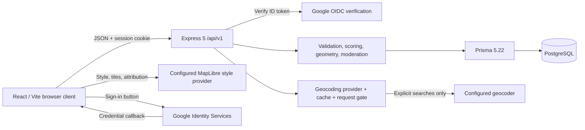

# System architecture

MapSafe is a modular monolith with a React web client and a versioned Express API. An npm workspace coordinates development; PostgreSQL is the authoritative store. The backend retains Prisma 5.22.

## Boundaries

The frontend owns presentation, drawing, browser permissions and form state. It sends geometry and review intent, never authoritative user IDs, roles or scores. Routes apply validation/access control; domain/service functions own business rules; Prisma handles persistence. Turf supplies geometry operations behind domain functions. Future native clients can reuse these rules through `/api/v1`; their credential/session transport needs separate design.

Areas store GeoJSON, centroid and bounds. Bounding boxes narrow viewport candidates; Turf performs exact point/overlap work in-process. This is an MVP trade-off, not equivalent to spatial indexes. [ADR-004](adr/ADR-004-geospatial-storage.md) describes PostGIS migration.

Scoring accepts an explicit clock in tests and calculates from eligible reports. No stored average is authoritative. Point queries combine distinct rating IDs. Visibility and suspended-user rules must be applied consistently across public map, detail, score and incident responses.

## Authentication and security

The GIS JavaScript callback sends its credential over a protected JSON request. The backend validates signature, issuer, audience, expiry and verified email, then upserts by Google subject. An opaque session cookie represents local authentication; the database stores its hash. HttpOnly limits script access; production cookies require HTTPS; logout revokes the session.

Mutations require an allowed Origin and `X-MapSafe-Request: web`. Credentialed CORS admits only the configured frontend origin. This is the application's JSON callback CSRF design. Switching to Google's direct HTML form-post integration requires that integration's documented double-submit validation. Helmet, bounded request bodies, rate limiting, environment validation and structured errors add defensive layers.

Cooldown checks and rating writes serialize per user inside a transaction. Reviewed geometry cannot move after reports exist. Moderation changes and audit entries are atomic. Admin role and active account status are checked by the backend.

## Operational model and limits

Prefer one HTTPS origin, forwarding `/api` and `/health` to the API. Keep PostgreSQL private. `/health` is liveness; migration checks plus a database-backed smoke request establish readiness.

Rate limits and geocoding cache/gate are process-local. Use one API instance with public Nominatim; multiple instances require a shared budget/cache or another provider. Sessions and audit data persist in PostgreSQL. Geometry query scalability, moderation retention and account deletion require deliberate operational work before unrestricted public launch.

See [API](06-API-Design.md), [database](05-Database-Design.md), [deployment](09-Deployment.md) and [ADRs](adr/README.md).
