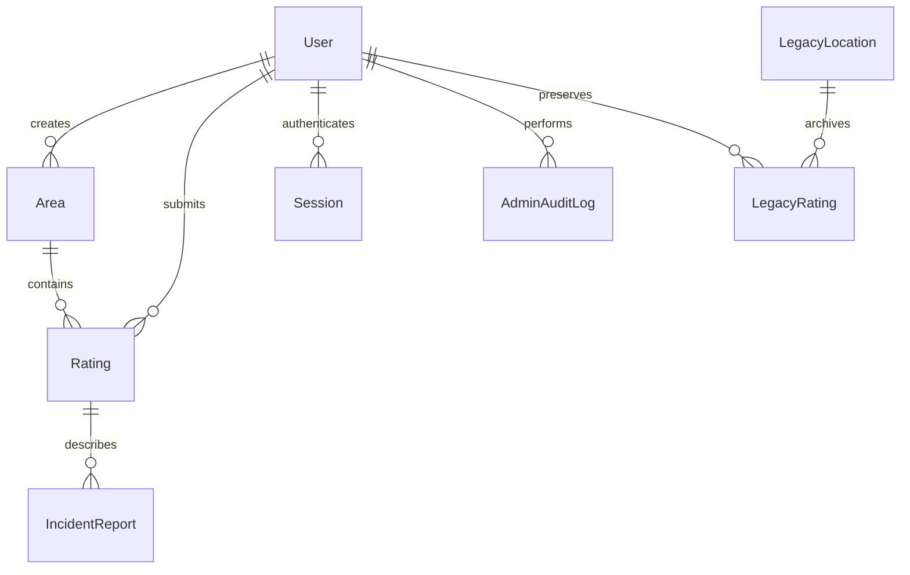

# Database design

The backend's single Prisma schema is [schema.prisma](../backend/prisma/schema.prisma). PostgreSQL stores the authoritative reports and account state. Prisma CLI/client remain pinned at 5.22.0; the root workspace delegates database commands.

## Models and invariants

| Model                             | Principal fields and responsibilities                                                                                                                                                                                            |
| --------------------------------- | -------------------------------------------------------------------------------------------------------------------------------------------------------------------------------------------------------------------------------- |
| `User`                            | ID, nullable unique Google subject for preserved legacy users, private unique email, name/avatar, role, active/suspended status, timestamps. Existing users are not linked to a new Google identity merely because emails match. |
| `Area`                            | Name, GeoJSON geometry, derived centroidLatitude/Longitude and min/maxLatitude/Longitude, creator, active/hidden status, timestamps.                                                                                             |
| `Rating`                          | User/area foreign keys, integer score, optional comment, visitedAt/attestedAt, verification method, optional verifiedAt/gpsAccuracy, moderation status, timestamps.                                                              |
| `IncidentReport`                  | Rating foreign key, category, optional Other type and narrative, independent moderation status, timestamps.                                                                                                                      |
| `Session`                         | User foreign key, unique SHA-256 token digest, creation and expiry times. Raw session secrets exist only in the cookie.                                                                                                          |
| `AdminAuditLog`                   | Administrator, entity type/ID, previous and resulting status, reason and timestamp.                                                                                                                                              |
| `LegacyLocation` / `LegacyRating` | Archived original point-based locations/reports, preserving original identifiers and user relations. They are not exposed as current quadrilateral areas.                                                                        |

Role values are `USER` and `ADMIN`. Account values are `ACTIVE` and `SUSPENDED`; content values are `ACTIVE` and `HIDDEN`. Verification values are `SELF_ATTESTED` and `GPS_VERIFIED`.

## Geometry

Prisma `Json` maps to PostgreSQL JSONB. Each geometry is a GeoJSON Polygon with exactly one ring: four distinct `[longitude, latitude]` corners and a final duplicate of the first corner. Backend validation rejects malformed rings, holes, self-intersection, collinear corners, out-of-range coordinates and unsupported size/spans. Centroid and bounds are calculated from validated geometry, never trusted from a request.

Status/bounds indexes narrow viewport candidates; exact intersection/containment uses Turf. Compound indexes also support area report history and a user's recent reports. This is adequate for a bounded MVP, not a spatial index. [ADR-004](adr/ADR-004-geospatial-storage.md) describes the PostGIS path.

Reviewed geometry cannot change because that would move others' experiences. Name updates are less consequential, but still require authorized ownership/admin access.

## Transactions and source of truth

The rating service validates eligibility and overlap, then creates a new area if supplied, its rating and incidents transactionally. Per-user serialization closes the race between cooldown check and insertion. Bounds limit geometric candidates; exact overlap is intersection area divided by the smaller polygon's area.

Scores are computed from eligible reports at read time; no stored average competes with the records. Soft-hidden parent records and suspended contributors affect public visibility according to the service filters. Hidden recent ratings still participate in cooldown checks.

Moderation status changes and corresponding audit entries are atomic. Sessions can be revoked independently of Google login. Suspension must be checked on every authenticated request so an existing session cannot bypass an account restriction.

## Migrations and existing data

Retain the initial `20260701202104_init` migration. The MVP forward migration renames/archives original `Location` and `Rating` tables and adds the new area, reporting, session and audit structures while retaining users. It does not manufacture polygons from points and does not delete old reports.

Before upgrading a database containing data:

1. Back it up and verify restoration on an isolated database.
2. Run the committed migrations on that copy.
3. Compare legacy user/location/rating counts and foreign-key relationships.
4. Inspect new schema and application queries; legacy content should remain archived, not become public area content.
5. Deploy only after migration and rollback/recovery are rehearsed.

No automatic legacy email account linking or polygon conversion is provided. Any later conversion needs explicit owner review and documented provenance.

Use `npm run db:migrate` for authoring local migrations, `npm run db:deploy` for applying committed migrations, and `npm run db:generate` after schema changes. Do not use `prisma db push` as a production migration strategy or edit applied migration files.

## Privacy and retention

Raw current GPS longitude/latitude is not a model field. Verification time/accuracy are limited metadata. Public DTOs deliberately exclude email, Google subject, session hashes and audit account details.

Soft moderation is not deletion. The MVP does not promise an automated retention/erasure workflow. The operator must define report, account, session, log and backup retention and a way to handle privacy requests before public launch. Purge expired sessions through an operational maintenance process; retain audit access only for authorized administrators.
