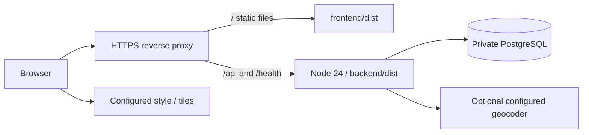

# Deployment and release guide

MapSafe can run on a vendor-neutral Node host with PostgreSQL and static frontend hosting. No hosting, external database, billing or domain is provisioned by this repository. Recheck costs and terms when selecting a host; a provider's “free tier” is not assumed permanent.

## Vercel with Neon

The repository root is an npm workspace. For one same-origin Vercel project, set the Root Directory to `.`, choose the Express framework preset, set the Build Command to `npm run vercel:build`, and leave Output Directory unset. Let Vercel detect the npm install command from the root lockfile. The tracked `public/.gitkeep` makes the static directory visible when Vercel inspects the repository; the build script then generates Prisma Client, compiles the backend, builds Vite and copies its static bundle into `public/` for Vercel's CDN. The root `server.mjs` exports the existing Express API. Do not deploy from the `frontend/` or `backend/` subdirectory as separate projects; the session cookie and Origin checks expect one HTTPS origin.

Set Vercel's Node.js version to 24.x. Configure production environment variables in Vercel, not Git: Neon `DATABASE_URL` (use its pooled connection string for function traffic), `GOOGLE_CLIENT_ID`, `ADMIN_EMAILS`, `TRUST_PROXY=true`, `ENABLE_DEV_AUTH=false`, `GEOCODING_PROVIDER=disabled`, and the public Vite settings such as `VITE_GOOGLE_CLIENT_ID`. Vercel's deployment URL is used as the default frontend origin; set `FRONTEND_ORIGIN` explicitly if using a custom production domain. Add that final origin to Google's authorized JavaScript origins. Preview deployments use their own Vercel URL and need corresponding Google origin configuration if real sign-in is required there.

Apply schema migrations separately with `npm run db:deploy` using Neon's direct connection string in a controlled shell before serving the new deployment. Do not use the pooled runtime URL for migrations if the provider's pooler does not support the migration connection features. Keep both connection strings private and out of logs, chat, Git and browser variables. Vercel Functions may run concurrently across instances, while MapSafe's public Nominatim request gate/cache are process-local. Keep geocoding disabled on Vercel until a shared application-wide rate gate and cache are implemented.

## Recommended topology



Prefer one HTTPS origin for frontend and API. Serve the Vite build with SPA fallback for frontend paths, and proxy API paths without rewriting away `/api/v1`. Keep API errors as API responses, not the SPA HTML. Do not expose a development Vite server in production.

The API runs behind the proxy on a private interface/network. If `TRUST_PROXY` is enabled, direct client access must not allow spoofed forwarding headers. PostgreSQL should require authenticated, encrypted connections where the deployment network requires it and should not be publicly reachable.

## Build artifact

Use the repository's Node/npm engine versions and committed lockfile:

```sh
npm ci
npm run db:generate
npm run typecheck
npm run lint
npm run format:check
npm test
npm run build
```

Run database integration/E2E and coverage checks separately as described in [testing](08-Testing-Strategy.md). Build output is `backend/dist/` and `frontend/dist/`. The backend's start command is:

```sh
npm run start -w backend
```

A runtime image/release needs the compiled backend, production dependencies, compatible Prisma client/engine, and migration files/CLI in the migration job. Generate Prisma for the deployment platform; do not assume a client generated on Windows can be copied into a Linux runtime unchanged.

Frontend environment is compiled into the bundle. Set the actual API path, Google public client ID, map style/provider/attribution and `VITE_ENABLE_DEV_AUTH=false` before building. Never embed secrets in `VITE_*`.

## Production configuration

Use [the environment reference](ENVIRONMENT.md) and the checked-in examples as the source of supported settings. At minimum configure:

- `NODE_ENV=production`, database connection and correct listener/proxy settings.
- The exact HTTPS `FRONTEND_ORIGIN`; keep credentialed CORS narrow.
- Real `GOOGLE_CLIENT_ID` and authorized Google JavaScript origin.
- Intended `ADMIN_EMAILS` only; validate authoritative Google email bootstrap.
- `ENABLE_DEV_AUTH=false` and frontend fixtures disabled.
- Map provider/style/attribution and geocoder configuration. Public Nominatim is enabled by default; disable it explicitly if the deployment cannot meet its usage policy or single-instance request budget.

Secret injection belongs to deployment configuration, not Git. The app needs no client secret in browser code. Do not import local demo passwords or seeded content. Verify secure cookies over HTTPS and login/logout from the intended origin.

The frontend static host must set its own security headers; API Helmet headers do not automatically protect static HTML on another host. Set an appropriate CSP for self, Google Identity, the chosen map style/tiles/fonts/sprites and MapLibre worker requirements. Test the actual Google flow and map under this policy. Avoid a broad wildcard policy merely to silence errors.

## Migration and recovery

Apply committed migrations with:

```sh
npm run db:deploy
```

Never use development migration generation or `db push` against production. The MVP forward migration preserves old point data as legacy tables and adds the quadrilateral domain; it does not infer boundaries. Legacy account linking is intentionally not automatic.

Before migration, make a backup and restore it to a disposable database. Run the migration there, compare legacy counts/relations and test application queries. For a live schema transition, stop incompatible old writers and use a maintenance window if needed. The previous point-model binary must not keep writing into renamed tables.

Rolling back the frontend/backend binary is not a database rollback. Rehearse a forward fix or restore the verified backup into a new database and switch configuration with a known data-loss window. Do not casually run down-migrations or delete legacy tables. Retain backups according to an explicit privacy/retention policy.

## Health, logs and operations

`GET /health` is a simple liveness endpoint. It is not proof that migrations, Google or the database are ready. Add a database-backed public read to post-deployment smoke checks and observe process exits/errors through the host's free/local logging facilities.

Use structured application output with request IDs and operational error context. Do not log credentials, cookies, complete request bodies, raw GPS, private email or production database URLs. Restrict access and set retention/rotation at the host. Treat reports and audit records as user data. Establish a privacy-request process rather than promising automatic erasure the MVP does not implement.

MVP request-rate limiting and geocoding cache/gate are process-local. With public Nominatim, run one API instance; adding replicas requires shared throttling/cache or a replacement provider. Geometry/report queries run in the application after bounds filtering. Monitor memory, query latency and candidate counts before growing traffic. Use [the PostGIS ADR](adr/ADR-004-geospatial-storage.md) when scale warrants a spatial index.

## Release checklist

- [ ] Clean install, client generation, typecheck, lint, format and production builds pass.
- [ ] Unit/component, database integration and E2E suites pass with recorded coverage.
- [ ] Empty-database and populated-legacy migrations pass; backup restoration is rehearsed.
- [ ] No secrets, local databases, development fixtures or demo reports enter production.
- [ ] Real Google sign-in/logout and intended administrator bootstrap work over HTTPS.
- [ ] Anonymous map/detail, area draw/edit, recent attestation, GPS optionality, incident Other, cooldown and moderation work.
- [ ] Map/search attribution, provider error states and provider usage limits are checked.
- [ ] Desktop/mobile, keyboard focus, text labels and readable errors are inspected.
- [ ] Production Origin/CORS/cookies/proxy/security headers and database permissions are checked.
- [ ] Owner has moderation, incident, privacy request, backup and retention procedures.
- [ ] Observe remote CI, review Git diff/status and record the tested commit.
- [ ] Publish release notes with limitations; tag only after approval and acceptance.

The suggested next version is `0.2.0`, or `0.2.0-beta.1` while external setup/operational validation is incomplete. This guide does not claim a release has been deployed or published.
